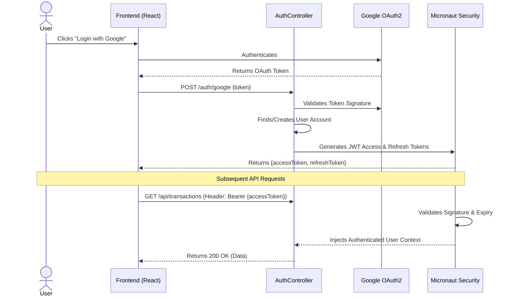

# Authorisation Architecture

Keeper utilizes stateless JWT (JSON Web Tokens) combined with Micronaut Security for robust, highly-scalable authentication.

## Security Flow

## Implementation Details
- **Token Storage**: The client stores the JWT (preferably in `HttpOnly` cookies for maximum XSS protection, or memory/local storage).
- **Workspace Isolation**: Every user owns a `Workspace`. Every API request inherently includes the `Workspace ID` which the `SecurityRule` checks against the authenticated user's allowed workspaces to prevent Broken Object Level Authorization (BOLA).
- **Configuration**: Managed in `application.yml` under `micronaut.security`.
