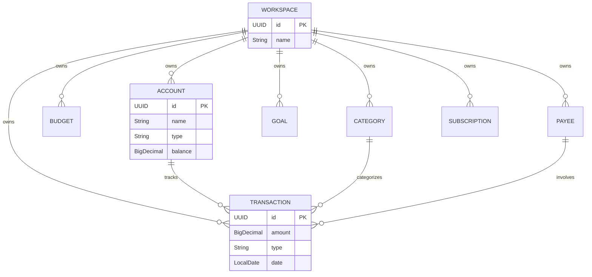
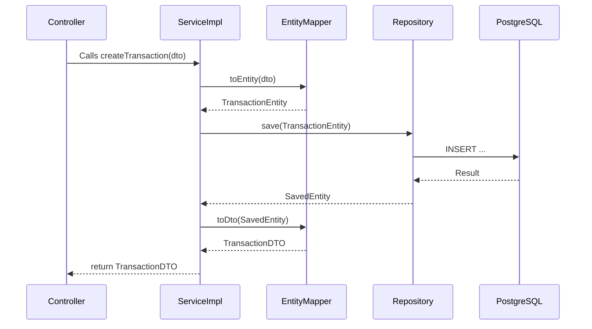

# Persistence Architecture

This document describes how data is handled and stored in Keeper using Micronaut Data JPA and PostgreSQL.

## Entity Relationship Diagram (ERD)

## Data Flow

When a request is received, it follows this strict Domain-Driven flow:

## Data Models
1. **Entities**: Annotated with `@Entity`, representing DB tables. Handled by Hibernate.
2. **DTOs**: Generated from OpenAPI specs, used for API contracts.
3. **Mappers**: `MapStruct` automatically converts Entities to DTOs for fast, reflection-free mapping.
